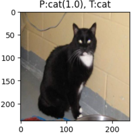
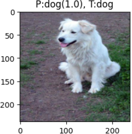
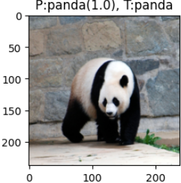
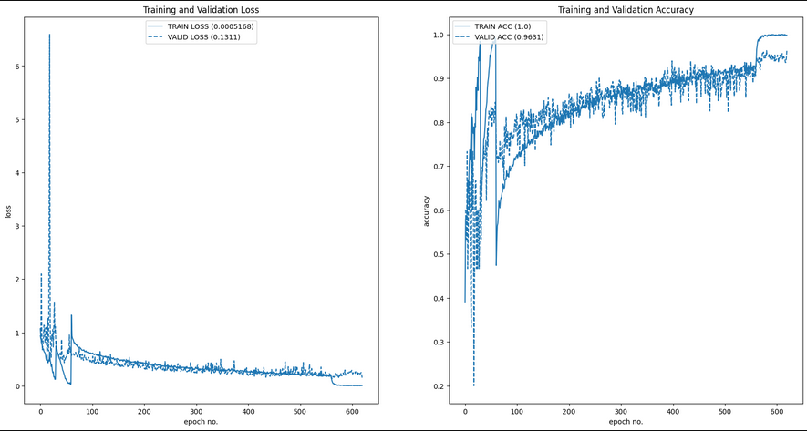
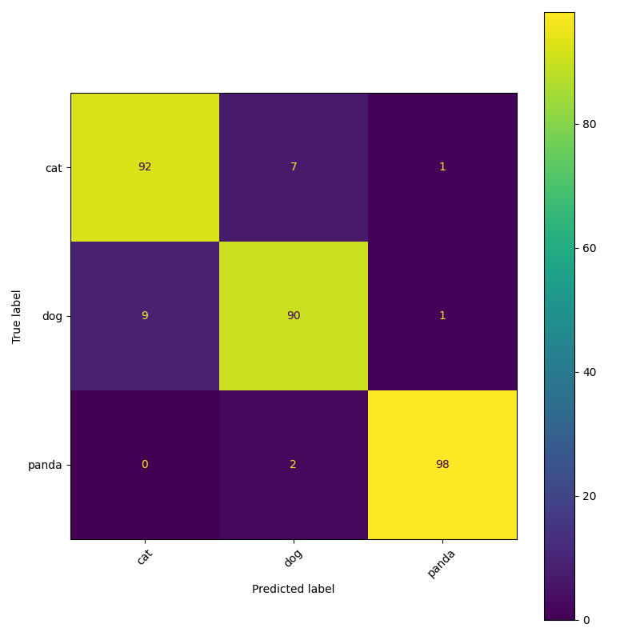
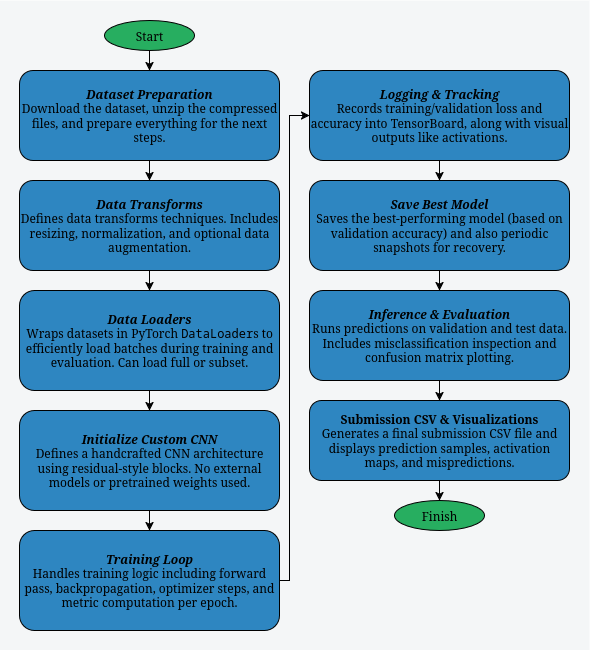

# From Scratch Image Classifier

This project walks through every step of designing, training, evaluating, and visualizing a CNN for multi-class image classification (cats, dogs, pandas). Achieves ≥85% accuracy on public test data with fully manual architecture and training logic. Includes data handling, model checkpointing, TensorBoard logging, inference utilities, and activation visualizations.

---

## Example Results

Below are a few sample predictions from the trained model, showcasing its performance on validation images. Each image displays the predicted label with confidence and the true label for comparison. The model demonstrates strong classification performance, even on visually similar inputs.

### Sample Predictions:

<div style="display: flex; justify-content: center; overflow-x: auto; width: 80%;">
  <table style="table-layout: auto; border-collapse: collapse;">
    <thead>
      <tr>
        <th style="text-align: left; padding: 8px;">Cat Prediction</th>
        <th style="text-align: left; padding: 8px;">Dog Prediction</th>
        <th style="text-align: left; padding: 8px;">Panda Prediction</th>
      </tr>
    </thead>
    <tbody>
      <tr>
        <td style="padding: 8px;">
          
        </td>
        <td style="padding: 8px;">
          
        </td>
        <td style="padding: 8px;">
          
        </td>
      </tr>
    </tbody>
  </table>
</div>


### Training Performance Training and Validation Dataset:

<div style="display: flex; justify-content: center; overflow-x: auto; width: 80%;">
  <table style="table-layout: auto; border-collapse: collapse;">
    <thead>
      <tr>
        <th style="text-align: left; padding: 8px;">Training Loss/Acc on Validation and Training Dataset</th>
      </tr>
    </thead>
    <tbody>
      <tr>
        <td style="padding: 8px;">
          
        </td>
      </tr>
    </tbody>
  </table>
</div>

### Confusion Matrix:

<div style="display: flex; justify-content: center; overflow-x: auto; width: 80%;">
  <table style="table-layout: auto; border-collapse: collapse;">
    <thead>
      <tr>
        <th style="text-align: left; padding: 8px;">Confusion Matrix over validation dataset</th>
      </tr>
    </thead>
    <tbody>
      <tr>
        <td style="padding: 8px;">
          
        </td>
      </tr>
    </tbody>
  </table>
</div>

---

## What It Does

This project builds a custom image classification pipeline from scratch. Without using any pre-trained models or external deep learning frameworks beyond PyTorch core. It is designed to train and evaluate a convolutional neural network (CNN) capable of achieving ≥ 85% accuracy on a 3-class image classification task.

Key features include:

* From-Scratch CNN Architecture
    Implements a residual-style convolutional neural network with custom skip connections, dropout, and batch normalization.

* End-to-End Training Loop
    Handles training, validation, learning rate scheduling, checkpointing, and logging via clean modular functions.

* Metric Tracking & Visualization
    Uses TensorBoard for real-time performance logging and matplotlib for detailed plots of training/validation accuracy and loss.

* Custom Data Handling
    Dynamically computes dataset statistics and supports full or subset-based loading, with optional data augmentation pipelines.

* Model Explainability Tools
    Includes layer activation visualizations, sample prediction plots, misclassification analysis, and a full confusion matrix.

* Submission-Ready Output
    Exports CSV predictions for a test set, making it easy to integrate with competitions or downstream pipelines.

* Modular and Reproducible
    Structured via configuration dataclasses for reproducibility, reusability, and quick hyperparameter tuning.

---

## Run Instructions

Clone the repository and build all projects in one step:

```bash
git clone https://github.com/sancho11/from_scratch_image_classifier.git
cd from_scratch_image_classifier
python -m venv .venv
source .venv/bin/activate  # On Windows, use: .venv\Scripts\activate
pip install -r requirements.txt
```

To run the project:

```bash
#For running the notebook pipeline using jupyter notebook
jupyter notebook
#For training a model using python
python train.py
#For running evaluation metrics on a trained model
python evaluate.py path/to/model
#For running classification on a single image.
python infierence.py path/to/model path/to/image
```
---

## Training
To get good inference results I recomend to follow this training sequence:

```bash
#First check everything is working with a fast test
python train.py --run_just_a_subset --half_precision
#Then we will start the training without data augmentation and with default values setting epochs count to 30
python train.py --epochs_count 30 --use_scheduler --half_precision
#Now train using data augmentation
python train.py --epochs_count 300 --use_scheduler --half_precision --data_augmentation --init_learning_rate 
25e-4 --resume Logs_Checkpoints/Model_checkpoints/version_1/best_model.pt
#Lets reduce the learning rate
python train.py --epochs_count 200 --use_scheduler --half_precision --data_augmentation --init_learning_rate 25e-5 --resume Logs_Checkpoints/Model_checkpoints/version_2/last_model.pt
#Lets do a final train without data augmentation and with complete precision
python train.py --epochs_count 60 --use_scheduler --init_learning_rate 1e-4 --resume Logs_Checkpoints/Model_checkpoints/version_3/last_model.pt
```
## Evaluating
Generate confusion matrix and do inference over whole dataset
``` bash
python evaluate.py /path/to/your/checkpoint.pt --output_dir ./eval_results --batch_size 16
```

## Inferring
Do an inference with a single image using a trained model
``` bash
python infer.py --model_path /path/to/your/checkpoint.pt --image_path /path/to/image
```

---

## Pipeline Overview
<p align="center">
  
  <br><em>Pipeline Diagram</em>
</p>


---

## Key Techniques & Notes

- **Model Architecture**  
    * Built from Scratch: Entire CNN defined manually using torch.nn, with no reliance on pre-trained models or external libraries.
    * Residual Blocks: Implements basic residual-style skip connections in all convolutional stages to improve gradient flow and training stability.
    * Progressive Depth: Feature channels increase across layers: 32 → 64 → 128 → 256.
    * Dropout Regularization:
      * Dropout2d after deeper convolutional blocks.
      * Fully-connected head uses standard dropout to mitigate overfitting.

- **Data Handling & Preprocessing**  
    * Custom Transforms:
      * Built-in normalization using per-dataset computed mean and std.
      * Optional augmentations including random affine transformations, color jitter, and equalization.
    * Dynamic Subset Loading: Toggle between full and small subsets for faster iteration during experimentation.
    * Mean/Std Estimation: Channel-wise statistics computed directly from training images via batched aggregation.

- **Training Infrastructure**
    * Custom Training Loops:
      * Separate train() and validate() functions with tqdm-based progress visualization.
      * Accuracy and loss tracked via torchmetrics.
    * Hyperparameter Control: Managed using dataclass configs (SystemConfig, TrainingConfig) for full reproducibility.
    * Learning Rate Scheduling: Optional per-epoch lambda-based decay with torch.optim.lr_scheduler.
  
- **Logging & Checkpointing**  
    * Versioned Logging: Auto-incremented directories for TensorBoard and checkpoint files to avoid overwriting.
    * TensorBoard Integration: Logs losses, accuracies, and layer activations with scalar and figure summaries.
    * Checkpointing Strategy:
      * Best model saved based on validation accuracy.
      * Intermediate model snapshots saved every 5 epochs.

- **Performance Monitoring**  
    * Loss & Accuracy Visualization:
      * Dual subplot figure compares train vs. validation metrics.
      * Annotated with min loss / max accuracy for interpretability.
    * Confusion Matrix: Final model performance across all classes using scikit-learn.

- **Inference & Visualization**
    * Batch Prediction & Display:
      * Predicts and visualizes multiple images in a grid format, showing predicted vs. true labels.
      * Misclassified samples highlighted for further inspection.
    * Layer Activation Logging:
      * Uses hooks to extract intermediate layer activations.
      * Visualizes top-activated filters for qualitative insight into what the model has learned.

- **Submission Pipeline**
  * Flat Test Inference:
    * Custom FlatImageDataset to infer over nested/unstructured test folders.
    * Generates a .csv formatted submission with filenames and predicted labels.